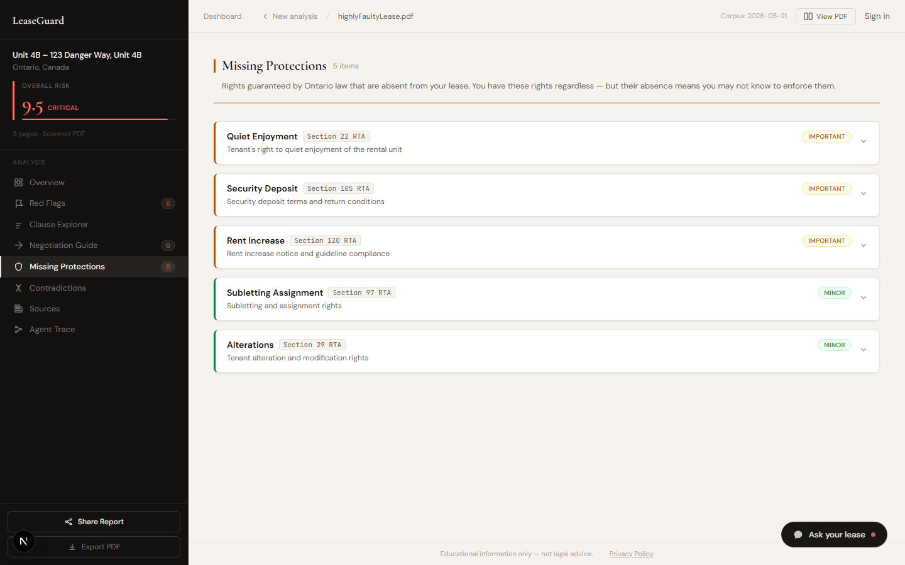
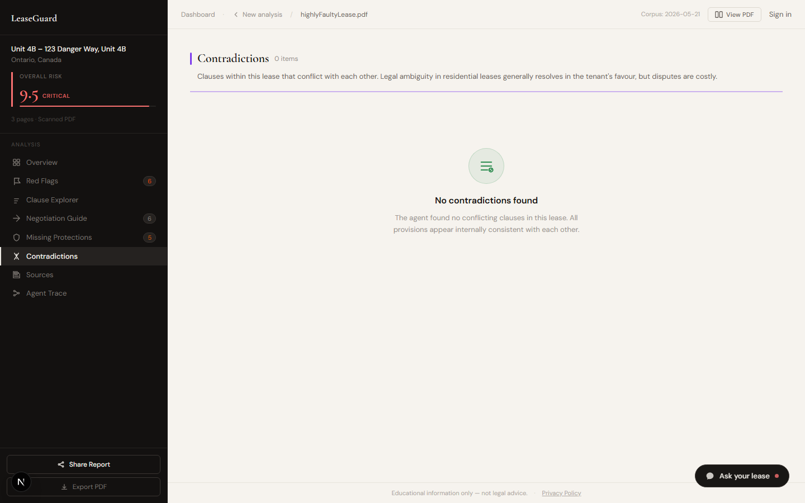
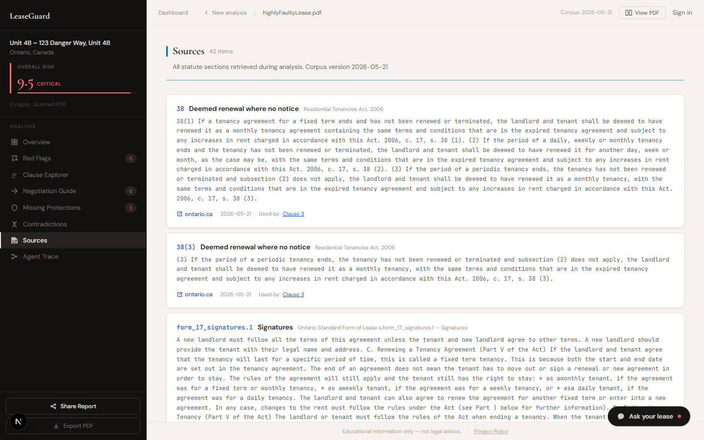
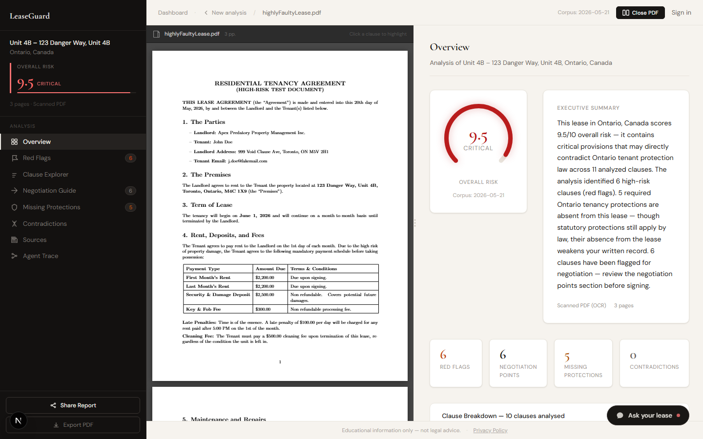
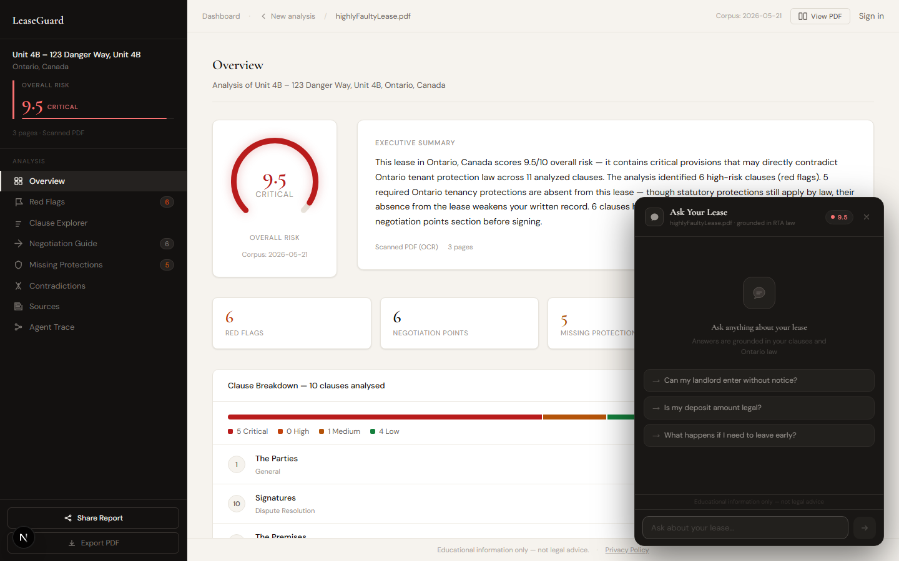
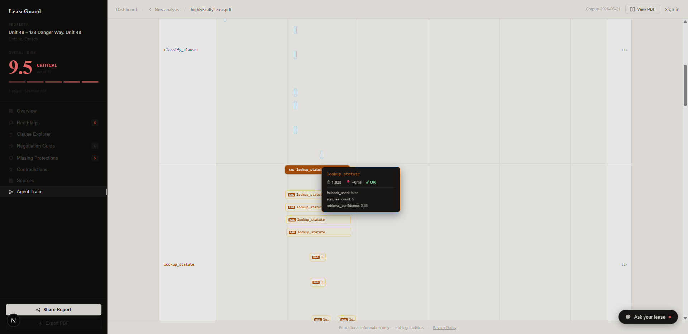
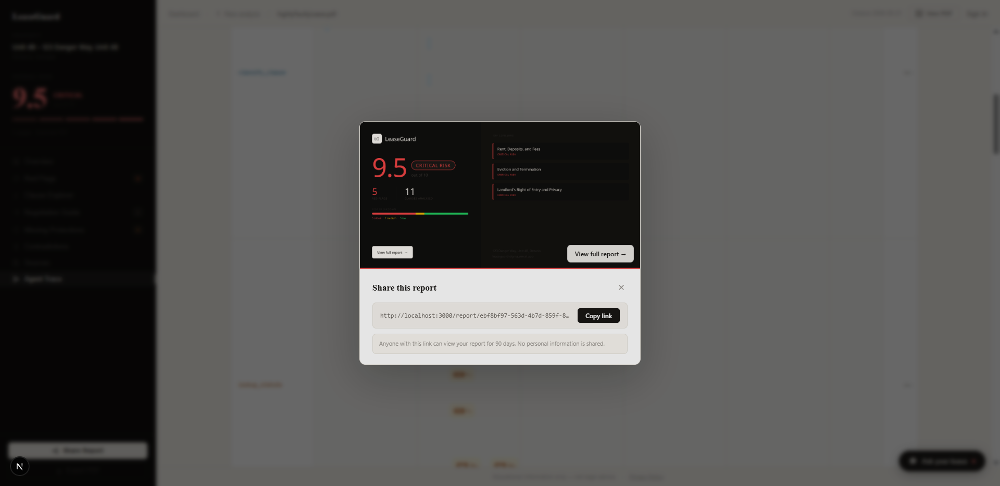

<div align="center">

# LeaseGuard

**AI-powered Ontario lease analysis grounded in real statute law.**

Upload your lease. Get a full risk report — every red flag cited to the RTA — in under 90 seconds.

[](https://github.com/parthiv-2006/lease-guard/actions/workflows/ci.yml)
[](#testing)
[](#testing)
[](#testing)
[](https://www.typescriptlang.org/)
[](https://nextjs.org/)
[](#)
[](https://leaseguard-sigma.vercel.app)

<br/>

| 📊 Scoring accuracy | 🔍 Retrieval precision | 🧪 Automated tests | 📚 Legal corpus |
|:-------------------:|:---------------------:|:-----------------:|:---------------:|
| **45 / 45** | **7 / 7** | **206** | **2,372 chunks** |
| 100% — zero false positives on a 45-case labelled suite covering all 17 violation types | 100% — hybrid BM25+vector on RTA + O.Reg + Standard Form at threshold 0.55 | 155 unit · 51 Playwright E2E · full CI on every push | RTA granular subsections · O.Reg 516/06 · O.Reg 517/06 · Standard Form · 84 LTB decisions |

<br/>


<br/>

**[→ Try it live at leaseguard-sigma.vercel.app](https://leaseguard-sigma.vercel.app)**

</div>

---

## Demo

<video src="https://github.com/parthiv-2006/lease-guard/releases/download/v1.0.0/demo.mp4" controls width="100%"></video>

> Shows: landing page → live stats bar → example findings → risk report → Red Flags with statute citations → Negotiation Copilot → Agent Trace replay + drill-down → Share modal → Ask Your Lease chat.

---

## What it does

LeaseGuard reads Ontario residential lease PDFs and produces a clause-by-clause risk report backed by retrieved statute and tribunal text. **The LLM never asserts legal facts from training data alone** — every finding is grounded in real law retrieved from a 2,372-chunk pgvector corpus of the Residential Tenancies Act, O.Reg 516/06, O.Reg 517/06, the Ontario Standard Form of Lease, and 84 real LTB tribunal decisions.

The result: **nine interactive panels** covering risk scoring, red flags, clause exploration, missing protections, negotiation guidance with AI copilot, contradiction detection, statute sources, PDF annotation, and a live Gantt trace of the agent's reasoning — plus a floating AI chat for follow-up questions, all grounded in the same retrieved corpus. The landing page shows a **live public stats bar** (real-time clause count and average risk score across all analyses). Every report has a **one-click share modal** with a generated OG preview card. The **Agent Trace** panel lets you replay the full tool-call sequence as a step-by-step animation, and clicking any RAG bar opens a **drill-down drawer** showing the exact Ontario statute text that was retrieved for that lookup.

---

## Report panels

<table>
<tr>
<td width="50%">

**Overview — 9.5 Critical**

Risk gauge, executive summary, and clause breakdown with per-clause risk levels. Four stat cards: Red Flags · Negotiation Points · Missing Protections · Contradictions.


</td>
<td width="50%">

**Red Flags**

Every problematic clause with its risk score, violation type, and the exact RTA section it breaches. Grounding confidence badge on each card.


</td>
</tr>
<tr>
<td width="50%">

**Clause Explorer**

Full text of every clause annotated with statute citations, enforceability status, benchmark percentiles, and suggested compliant language.


</td>
<td width="50%">

**Negotiation Guide**

Prioritised negotiation points with counter-language and action items. One-click **Negotiation Copilot** drafts a tone-aware email or addendum (Assertive / Formal / Cooperative) via Groq Llama 3.3 70B.


</td>
</tr>
<tr>
<td width="50%">

**Missing Protections**

Identifies Ontario RTA protections absent from the lease. Statutory protections still apply by law — their absence from the written lease weakens the tenant's position.



</td>
<td width="50%">

**Contradictions**

Conflicting clauses rendered side-by-side with LLM-detected contradictions (confidence gate ≥ 0.65, regex fallback).



</td>
</tr>
<tr>
<td width="50%">

**Sources**

Every RTA section, regulation, and LTB decision retrieved for this lease — 2,372-chunk corpus with full body text and citation URLs.



</td>
<td width="50%">

**Agent Trace — Live Gantt + Replay**

Every tool call the agent made, with duration, parallel swim lanes, and input/output summaries. 67 tool calls for a 3-page lease. Switchable Gantt / List view. Hit **▶ Watch the agent work** to animate all tool calls firing in sequence (~15s). Click any amber RAG bar to open a drill-down drawer showing the exact Ontario statute text retrieved for that lookup.


</td>
</tr>
<tr>
<td width="50%">

**PDF Viewer**

Full pdfjs-dist v5 rendered PDF with persistent clause highlight annotations. Highlights survive page turns and scroll without index drift.



</td>
<td width="50%">

**Ask Your Lease — AI Chat**

Floating chat panel powered by Groq Llama 3.3 70B with RAG grounding. Questions are answered with retrieved statute and LTB decision citations — the model never answers from memory alone.



</td>
</tr>
<tr>
<td width="50%">

**Trace Drill-Down**

Click any amber RAG bar in the Agent Trace Gantt to open a detail drawer. Shows the search query, retrieved statute sections with full body text, citation URLs, and match confidence — the real law the agent used, not a summary.



</td>
<td width="50%">

**Share Modal + OG Card**

One-click share button on every report opens a modal with a live-generated OpenGraph preview card (1200×630 dark card showing risk score and top clauses) and a copy-link button. Links are valid for 90 days with no personal information exposed.



</td>
</tr>
</table>

---

## How it works

```
User uploads PDF
       │
       ▼
Next.js API route ── creates job ──► Supabase Storage (PDF)
       │
       ▼
Claude Agent (MCP client)
       │  calls 12 tools dynamically, in parallel batches
       ▼
MCP Server (TypeScript / Node.js)
  ├─ parse_document        PyMuPDF + Tesseract OCR
  ├─ detect_jurisdiction   LLM + regex
  ├─ segment_into_clauses  LLM
  ├─ classify_clause       LLM
  ├─ lookup_statute   ─┐
  ├─ lookup_tribunal  ─┤── Supabase pgvector (Gemini embeddings)
  │                    │   Hybrid BM25 + vector · RRF merge · 3 queries/clause
  ├─ score_clause_risk ─── Deterministic TypeScript regex (NOT LLM)
  ├─ detect_contradiction  LLM (Claude Haiku 4.5) · confidence gate ≥ 0.65
  ├─ check_missing_clauses Supabase checklist lookup
  ├─ benchmark_clause      Supabase PostgreSQL (50-row corpus)
  ├─ generate_negotiation  LLM (retrieved statutes as input)
  └─ generate_report       Structured assembly
       │
       ▼
Supabase PostgreSQL  +  pgvector  +  Storage

       │  (after report loads)
       ▼
Ask Your Lease chat  ── Groq Llama 3.3 70B + same RAG corpus
Negotiation Copilot  ── Groq Llama 3.3 70B JSON mode
```

**Why grounded retrieval matters:** risk scoring is deterministic TypeScript — no LLM can hallucinate a score. Statute citations come from a pre-validated corpus (7/7 retrieval accuracy), not model memory. Clause enforceability is only flagged when a specific `MANDATORY_PROVISION_VIOLATION` is detected, not just because text sounds unusual.

> **Architecture deep-dive →** [docs/ARCHITECTURE.md](docs/ARCHITECTURE.md) covers every major design decision: why MCP over raw function-calling, why pgvector over Pinecone, why Claude as the agent when Gemini is free, and why scoring is deterministic TypeScript instead of a second LLM call.

---

## Tech stack

| Layer | Technology | Notes |
|-------|-----------|-------|
| Frontend | Next.js 15 (App Router, React 19) | TypeScript, vanilla CSS design system |
| Agent | Claude Haiku 4.5 via Anthropic SDK | MCP client — tool orchestration |
| Chat & Copilot | Groq `llama-3.3-70b-versatile` | OpenAI-compatible API; 14,400 RPD free tier — no quota conflicts with embeddings |
| Embeddings | Gemini `gemini-embedding-001` | REST only (768-dim); never the SDK |
| Vector DB | Supabase pgvector | Hybrid BM25 + vector · RRF merging · threshold 0.55 |
| Database | Supabase PostgreSQL | Leases, clauses, reports, jobs, chat, feedback |
| Storage | Supabase Storage | Uploaded PDFs, signed URL refresh |
| MCP Server | TypeScript / Node.js | 12 tools, stdio + SSE transport |
| PDF Parsing | Python (PyMuPDF + Tesseract) | Subprocess from MCP server |
| PDF Viewer | pdfjs-dist v5 | Canvas + text layer, persistent clause annotations |
| AI Safety | Custom injection detector | 25-pattern prompt injection filter on all LLM routes |
| CI | GitHub Actions | 4-job parallel pipeline: typecheck → test → build → e2e |

---

## Deployment

LeaseGuard is fully deployed across three free-tier services:

| Service | Platform | URL |
|---------|----------|-----|
| Frontend + API routes | [Vercel](https://vercel.com) (free) | [leaseguard-sigma.vercel.app](https://leaseguard-sigma.vercel.app) |
| MCP server (always-on) | [Railway](https://railway.app) (free $5/mo credit) | `leaseguard-mcp-production.up.railway.app` |
| Database + vector store + file storage | [Supabase](https://supabase.com) (free) | Managed PostgreSQL + pgvector + Storage |

**Why separate the MCP server?** Vercel serverless functions have a 10-second cold-start limit on the free tier; the MCP server runs a long-lived stdio process and must stay warm. Railway keeps it always-on with a $5/month credit that covers the free tier entirely.

**Uptime monitoring:** Two UptimeRobot monitors ping both health endpoints every 5 minutes to warm Railway before a real upload arrives:
- `GET /api/job/health` (Vercel)
- `GET https://leaseguard-mcp-production.up.railway.app/health` (Railway)

---

## Features at a glance

### Grounded legal analysis
Every risk flag is backed by a retrieved RTA section or LTB decision — not a guess. The scoring engine is deterministic TypeScript (17 `MANDATORY_PROVISION_VIOLATION` types), so scores are reproducible and explainable.

### Ask Your Lease
A floating chat panel on every report page. Ask natural-language questions ("Is this late fee legal?") and get streaming answers grounded in the same retrieved corpus — statute citations included. Rate-limited at 50 messages/day for authenticated users, 10/day for guests.

### Negotiation Copilot
One click generates a tone-aware email or lease addendum via Groq JSON mode. Choose Assertive, Formal, or Cooperative tone. Export to PDF via jsPDF. Falls back to a template if the LLM is unavailable.

### Live Agent Trace + Replay
See every tool call the agent made, how long it took, and which calls ran in parallel — rendered as a Gantt chart or a flat list. 67 tool calls for a typical 3-page lease. Hit **▶ Watch the agent work** to replay the full sequence as a step-by-step terminal animation. Click any amber RAG bar to open a **drill-down drawer** with the exact retrieved statute text and citation URLs.

### Live public stats
The landing page fetches `/api/stats` on load and displays live counters: average risk score and total clauses analysed across all reports. Backed by a Supabase aggregate view — no PII exposed.

### Share card
Every report has a **Share Report** button that opens a modal with a generated 1200×630 OpenGraph preview card (dark background, risk score, top flagged clauses) and a copy-link button. Links are valid for 90 days; no personal information is included in the preview.

### PDF Viewer with clause highlights
pdfjs-dist v5 renders the original PDF with colour-coded risk annotations that persist across page turns. Highlights use a normAndMap algorithm to survive OCR position drift.

### PIPEDA compliance
Upload consent gate, privacy policy, data retention notice, and DELETE erasure API. Benchmarked clause text is PII-stripped before storage. Signed URLs expire after 1 hour.

---

## Getting started

### Prerequisites

- Node.js 20+
- Python 3.10+ with `pip`
- Tesseract OCR — `choco install tesseract` (Windows) or `brew install tesseract` (macOS)

### 1 — Clone and install

```bash
git clone https://github.com/parthiv-2006/lease-guard.git
cd lease-guard
npm install
cd mcp-server && npm install && cd ..
pip install -r scripts/requirements.txt
```

### 2 — Environment variables

Create `.env.local` in the project root **and** `.env` (the MCP server reads `.env`):

```env
ANTHROPIC_API_KEY=sk-ant-api03-...        # From console.anthropic.com
GEMINI_API_KEY=AIzaSy...                  # Embeddings only (gemini-embedding-001)
GROQ_API_KEY=gsk_...                      # Chat + Negotiation Copilot (groq.com/keys)
SUPABASE_URL=https://<project>.supabase.co
SUPABASE_ANON_KEY=eyJ...
SUPABASE_SERVICE_ROLE_KEY=eyJ...
NEXT_PUBLIC_SUPABASE_URL=https://<project>.supabase.co
NEXT_PUBLIC_SUPABASE_ANON_KEY=eyJ...
```

### 3 — Database migrations

Apply all 10 migrations in `supabase/migrations/` via the Supabase dashboard or CLI:

```bash
supabase db push
```

### 4 — Build the statute corpus

```bash
python scripts/build_corpus.py          # RTA granular subsections (~2,196 chunks)
python scripts/build_regulations.py     # O.Reg 516/06, O.Reg 517/06, Standard Form

# Validate retrieval accuracy (expect 7/7):
python scripts/validate_retrieval.py
```

### 5 — Run

```bash
# Terminal 1: Next.js dev server
npm run dev

# Terminal 2: MCP server (required for analysis)
npm run mcp:dev
```

Open [http://localhost:3000](http://localhost:3000) and upload a lease PDF.

---

## Testing

```bash
# Unit + integration tests (155 passing)
npm test

# With coverage report
npm test -- --coverage

# End-to-end tests (51 Playwright tests)
npm run test:e2e

# Scoring accuracy eval — 45-case labelled suite (expect OVERALL: PASS)
node scripts/eval-accuracy.mjs

# Retrieval accuracy — validates pgvector corpus (expect 7/7)
python scripts/validate_retrieval.py

# MCP server type check + build
cd mcp-server && npm run build
```

**Test breakdown (206 total):**

| Suite | Tests | What it covers |
|-------|-------|---------------|
| `api-upload.test.ts` | 12 | File validation, size limits, DB-backed rate limiting |
| `api-report.test.ts` | 10 | Response shape, normalisation, DELETE cascade |
| `api-job.test.ts` | 8 | SSE job status, polling transitions |
| `api-job-retry.test.ts` | 7 | Retry endpoint — blocks wrong-jurisdiction errors |
| `api-chat.test.ts` | 13 | Groq streaming, RAG retrieval, rate limiting |
| `api-negotiation.test.ts` | 7 | Tone variants, Groq JSON mode, template fallback |
| `lib-agent.test.ts` | 9 | Pipeline tool call sequencing, 3-min timeout |
| `rate-limiter.test.ts` | 20 | Token bucket behaviour (in-memory + DB-backed) |
| `trace-timeline.test.ts` | 34 | Gantt swim-lane computation helpers |
| E2E (`e2e/landing.spec.ts` + `report.spec.ts` + `chat.spec.ts` + `static-pages.spec.ts`) | 43 | Landing, static pages, report panels, chat |
| E2E (`e2e/wow-features.spec.ts`) | 8 | F1 live stats · F2 OG card · F3 trace drill-down · F4 replay |

All external services (Supabase, Anthropic, Groq, Gemini) are mocked in `__tests__/setup.ts` — no credentials required to run the unit suite.

---

## CI

Every push and pull request to `main` runs four jobs:

```
push / PR
    │
 ┌──┴──┐
type  test     ← parallel
 └──┬──┘
    │
  build        ← only if both pass
    │
   e2e         ← Playwright against production build
```

| Job | What it checks |
|-----|---------------|
| `typecheck` | `tsc --noEmit` on both the Next.js app and MCP server |
| `test` | Jest suite (113 tests), uploads lcov coverage artifact |
| `build` | MCP server `tsc` compile + Next.js production build |
| `e2e` | 51 Playwright tests against the built app |

See [`.github/workflows/ci.yml`](.github/workflows/ci.yml).

---

## Project structure

```
├── app/
│   ├── page.tsx                    Landing page + upload + job polling + live stats bar
│   ├── dashboard/page.tsx          All leases with job status (complete/failed/in-progress)
│   ├── report/[id]/page.tsx        Report shell + share modal + normaliseApiResponse()
│   ├── report/[id]/layout.tsx      Per-report OpenGraph + Twitter metadata
│   ├── report/[id]/opengraph-image.tsx  Edge-rendered OG card (1200×630, Satori)
│   ├── privacy/ · terms/ · about/  Static legal and info pages
│   ├── components/
│   │   │   ├── overview-panel.tsx      Risk gauge, stats, clause breakdown
│   │   ├── panels.tsx              Red Flags · Clause Explorer · Negotiation ·
│   │   │                           Missing Protections · Contradictions · Sources ·
│   │   │                           AgentTracePanel (Gantt + replay + drill-down drawer)
│   │   ├── negotiation-copilot.tsx Groq JSON mode copilot modal (email + addendum)
│   │   ├── lease-chat.tsx          "Ask Your Lease" floating chat (Groq + RAG)
│   │   ├── pdf-viewer.tsx          pdfjs-dist v5, canvas + text layer, clause highlights
│   │   ├── trace-timeline.tsx      Live Gantt chart (swim lanes, duration bars)
│   │   ├── trace-timeline.utils.ts toolCategory + CATEGORY_COLOR helpers
│   │   └── shared.tsx              RiskArc, RiskBadge, StatCard, FeedbackBar
│   └── api/
│       ├── upload/route.ts         PDF intake, DB-backed rate limiting (5/day auth · 3/day guest)
│       ├── job/[id]/route.ts       SSE job status stream (3-min timeout)
│       ├── job/[id]/retry/route.ts POST retry for failed analyses
│       ├── report/[id]/route.ts    GET (4 parallel table fetches) + DELETE cascade
│       ├── chat/[leaseId]/route.ts Groq SSE streaming chat + hybrid RAG
│       ├── negotiation/generate/   Groq JSON mode — email + addendum drafts
│       ├── stats/route.ts          Aggregate stats (avg risk, clause count) — no PII
│       ├── stream/[id]/route.ts    SSE live progress events
│       └── feedback/route.ts       Thumbs up/down with comment
│
├── lib/
│   ├── agent.ts                    14-step pipeline, parallel clause batches, 3-min timeout
│   ├── mcp-client.ts               stdio ↔ SSE transport auto-select
│   ├── ai-safety.ts                25-pattern prompt injection detector + sanitizers
│   ├── upload-rate-limit.ts        DB-backed per-user/IP rate limiter
│   └── pdf-export.ts               jsPDF report + copilot export
│
├── mcp-server/src/
│   ├── tools/
│   │   ├── score-risk.ts           Deterministic regex scoring (17 violation types, NOT LLM)
│   │   ├── lookup-statute.ts       Hybrid BM25+vector · 3 queries · RRF · threshold 0.55
│   │   ├── detect-contradiction.ts Claude Haiku 4.5 · confidence gate 0.65 · regex fallback
│   │   └── [9 other tools]
│   └── start.ts                    Entry point — dotenv then dynamic import
│
├── scripts/
│   ├── build_corpus.py             RTA granular subsection rows
│   ├── build_regulations.py        O.Reg 516/06 + 517/06 + Standard Form
│   ├── seed_decisions_exa.mjs      Real CanLII decisions via Exa REST API
│   ├── validate_retrieval.py       7/7 corpus accuracy check
│   ├── eval-accuracy.mjs           30-case precision/recall eval harness
│   └── capture-screenshots.mjs    README screenshot generation
│
├── e2e/
│   ├── landing.spec.ts             8 tests
│   ├── static-pages.spec.ts        12 tests
│   ├── report.spec.ts              15 tests
│   └── chat.spec.ts                13 tests
│
├── e2e/
│   ├── landing.spec.ts             8 tests
│   ├── static-pages.spec.ts        7 tests
│   ├── report.spec.ts              15 tests
│   ├── chat.spec.ts                13 tests
│   └── wow-features.spec.ts        8 tests — F1 stats · F2 OG card · F3 drill-down · F4 replay
│
└── supabase/migrations/            13 migrations (001–013, all applied)
    ├── 001_initial_schema.sql
    ├── 005_hybrid_search.sql       fts_vector column + GIN index + hybrid search RPC
    ├── 006_lease_address.sql       Property address extraction
    ├── 009_upload_ip.sql           DB-backed upload rate limiting
    ├── 010_chat_requests.sql       Chat rate limiting table
    └── 013_public_stats_view.sql   Aggregate stats view (no PII)
```

---

## Recording a demo video

Target: **60–90 seconds**, no audio needed, 1920×1080, exported as MP4 (H.264) + WebM for the README embed.

### Recommended tool

**ShareX** (Windows, free) — record a fixed region, outputs WebM/MP4 directly, no post-processing needed. Download at [getsharex.com](https://getsharex.com).

Alternative: `npx playwright test --video=on` captures WebM automatically during the `wow-features.spec.ts` run, but the viewport is fixed at 1280×720 and you can't control pacing.

### Before recording

1. Set browser window to 1920×1080 and zoom to 100%.
2. Open a private/incognito window at `https://leaseguard-sigma.vercel.app` — avoids "Sign in" prompts during recording.
3. Pre-open DevTools → Network tab, filter `XHR` — useful for showing the `/api/stats` call resolving live if you want a technical audience.
4. Have the demo lease URL ready in a second tab: `/report/ebf8bf97-563d-4b7d-859f-8ecf76905335`.

### Shot sequence (with target timestamps)

| # | Action | Target time | Notes |
|---|--------|------------|-------|
| 1 | Land on homepage — let stats bar count up | 0:00–0:08 | Pause briefly on the live counters: **6.7 avg · 444 clauses** |
| 2 | Drag or click to select `ontario_standard_lease.pdf` | 0:08–0:14 | Use `scripts/source-docs/ontario_standard_lease.pdf` |
| 3 | Tick consent checkbox, click Analyse | 0:14–0:16 | |
| 4 | Processing screen — step indicators animating | 0:16–0:30 | Let all 5 steps fill in; don't cut early |
| 5 | Report loads — Overview panel | 0:30–0:38 | Show risk gauge + stat cards (Red Flags, Negotiation Points, etc.) |
| 6 | Click **Red Flags** tab — expand one flag | 0:38–0:48 | Scroll to show the RTA citation below the clause text |
| 7 | Click **Negotiation Guide** → open Copilot → choose Assertive tone | 0:48–1:00 | Wait for Groq to stream the draft; don't cut mid-stream |
| 8 | Click **Agent Trace** → hit **▶ Watch the agent work** | 1:00–1:12 | Let ~10s of animation play; click a RAG bar mid-animation to show drill-down |
| 9 | Click **Share Report** → show OG card in modal | 1:12–1:18 | |
| 10 | Click **Ask your lease** chat bubble → type "Is this late fee legal?" → wait for streaming answer | 1:18–1:30 | End on the statute citation line |

**Total: ~90 seconds.** Cut aggressively between steps 5–6 and 6–7 if the recording runs long.

### Export settings (ShareX)

- Format: MP4 (H.264, CRF 22) for the GitHub release asset
- Also export WebM (VP9) for the `<video>` embed in the README
- Upload MP4 to a GitHub release tagged `v1.x.0`, then update the `src` in the `## Demo` section

### After recording

Replace the `## Demo` video source with the new release URL:

```markdown
<video src="https://github.com/parthiv-2006/lease-guard/releases/download/v1.x.0/demo.mp4" controls width="100%"></video>
```

---

## Legal disclaimer

LeaseGuard provides educational information only and does not constitute legal advice. For matters requiring professional legal judgment, consult a licensed paralegal or lawyer. Analysis is grounded in the Ontario Residential Tenancies Act, 2006.
