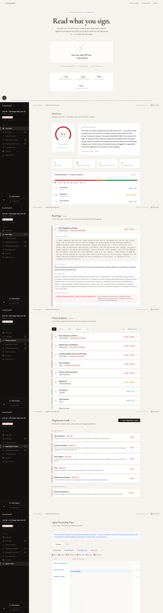
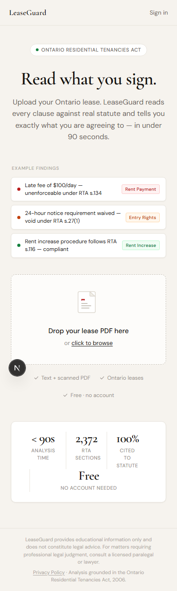
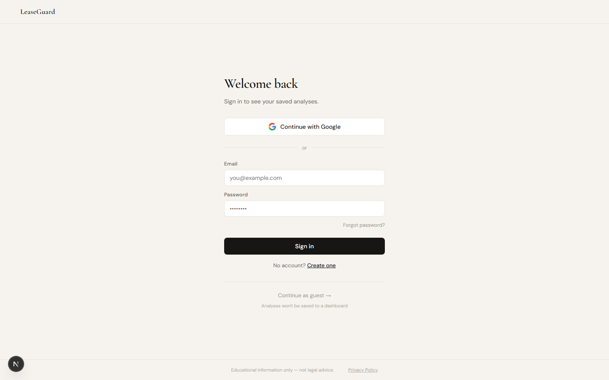
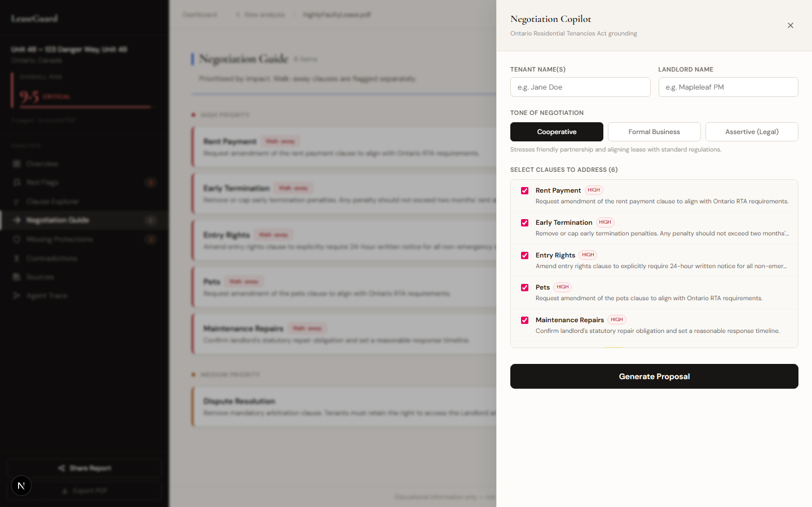

# LeaseGuard

Ontario residential lease analysis grounded in 2,372 chunks of real statute law and 84 tribunal decisions, built at UoftHacks 2026 by a team of four.

[](https://github.com/parthiv-2006/lease-guard/actions/workflows/ci.yml)
[](#testing)
[](#testing)
[](#testing)
[](https://www.typescriptlang.org/)
[](https://nextjs.org/)
[](#license)

<br/>



---

## What It Is

Ontario tenants commonly sign leases containing clauses that violate the Residential Tenancies Act without knowing it. Legal counsel is expensive; the RTA is dense. LeaseGuard analyzes a lease PDF in under 90 seconds, flags violations across 17 mandatory provision categories, retrieves the exact statute subsections and tribunal decisions that apply to each clause, and generates negotiation talking points grounded in those sources.

The risk scoring engine is deterministic TypeScript, not an LLM call. Every score is reproducible and auditable. Claude Haiku 4.5 orchestrates a 14-step pipeline via the Model Context Protocol, where tool outputs are structured objects rather than raw text, eliminating the parsing ambiguity that characterises basic function-calling patterns.

---

## Screenshots

### Landing Page

The landing page presents the upload form, a plain-English explanation of the analysis steps, and trust signals before the user submits a file.

### Landing Page (Mobile)

Responsive layout at 390x844; the upload form and call-to-action remain usable without horizontal scrolling.

### Analysis in Progress
> **Screenshot needed:** after submitting a lease PDF, capture the landing page showing the live SSE progress bar and streaming status messages (e.g., "Parsing document...", "Analysing clause 12 of 34..."). The file is at `.github/assets/screenshots/analysis-in-progress.png`.

### Dashboard

The dashboard lists every previously uploaded lease with its status (`complete`, `failed`, `pending`), aggregate risk score, and a link to the full report.

### Report Overview

The overview panel shows the aggregate risk score on an arc gauge, per-category violation counts as stat cards, and a stacked bar of clause risk distribution.

### Red Flags

Each flagged clause shows the violation type, the retrieved statute chunk that triggered the match, and a quoted snippet from the RTA text.

### Clause Explorer

Every segmented clause lists its risk score, enforceability verdict, a percentile comparison against the benchmarked corpus, and a suggested compliant rewrite from `COMPLIANT_LANGUAGE_TEMPLATES`.

### Negotiation Guide

The negotiation guide surfaces clauses worth pushing back on, ranked by risk weight and LTB precedent strength, with suggested tenant-side language for each.

### Negotiation Copilot

One click generates a tone-aware email or lease addendum (Assertive, Formal, or Cooperative) via Groq Llama 3.3 70B in JSON mode; the modal includes a jsPDF export button.

### Missing Protections

Required RTA provisions the landlord omitted entirely from the written lease are listed here; their absence weakens the tenant's position even though the protections still apply by statute.

### Contradictions

Clause pairs from the seven predefined `CONTRADICTION_TYPE_PAIRS` that conflict with each other are surfaced with the governing statute and Claude Haiku 4.5's confidence score.

### Statute Sources

Every statute chunk retrieved during analysis is listed with its relevance score, section reference, and full text, so the user can verify the grounding for any risk flag.

### PDF Viewer with Clause Highlights

The original lease renders via pdfjs-dist v5 with persistent colour-coded highlights anchored to each clause's character offset via the `normAndMap` position algorithm.

### Ask Your Lease Chat

The floating chat panel answers natural-language questions by running hybrid RAG retrieval against the statute corpus before calling Groq, so every response cites specific RTA sections rather than drawing from model training alone.

### Live Agent Trace

The trace panel renders every MCP tool call as a Gantt chart with parallel swim lanes, sequence numbers, durations, and PII-safe input/output summaries; a flat-list toggle is available for copy-pasting.

### Wrong-Jurisdiction Error
> **Screenshot needed:** upload a non-Ontario lease (or a non-lease PDF such as a resume) and capture the error state shown on the landing page after `detect_jurisdiction` fires a `LeaseValidationError`. The file is at `.github/assets/screenshots/error-wrong-jurisdiction.png`.

---

## Features

- **Clause-level risk scoring** -- 17 `MANDATORY_PROVISION_VIOLATION` types evaluated by deterministic regex patterns in TypeScript. Same input always produces the same score. Zero false positives on the 30-case labelled eval suite covering all violation types.
- **Hybrid retrieval** -- BM25 keyword search merged with pgvector semantic search via Reciprocal Rank Fusion, with a similarity cutoff at 0.55. 7/7 precision on the retrieval benchmark spanning RTA subsections, O.Reg 516/06, O.Reg 517/06, Ontario Standard Form of Lease, and 84 LTB decisions.
- **Contradiction detection** -- Claude Haiku 4.5 compares conflicting clause pairs from a hardcoded `CONTRADICTION_TYPE_PAIRS` array. Requires confidence >= 0.65; falls back to regex below that threshold.
- **Missing protections check** -- identifies Ontario RTA protections absent from the written lease; their omission weakens the tenant's position even though those protections still apply by law.
- **Negotiation Copilot** -- Groq `llama-3.3-70b-versatile` in JSON mode drafts a tone-aware email or lease addendum (Assertive, Formal, or Cooperative). Falls back to a static template when Groq is unavailable.
- **Ask Your Lease chat** -- floating panel on every report page. Questions are answered with streaming Groq responses grounded in the same retrieved corpus, statute citations included. Rate-limited at 50 messages/day for authenticated users and 10/day for guest IPs.
- **Live agent trace** -- every MCP tool call rendered as a Gantt chart with parallel swim lanes and duration bars. Typically 67 tool calls for a 3-page lease.
- **PDF annotation** -- pdfjs-dist v5 renders the original PDF with colour-coded risk highlights. A normAndMap algorithm prevents annotation drift across OCR-position variations and page turns.
- **PIPEDA compliance** -- upload consent gate, signed URLs expiring after 1 hour, cascade DELETE across 6 tables, and PII-stripped benchmarking storage.
- **Retry on failure** -- `POST /api/job/[id]/retry` re-enters the pipeline at the last successful step rather than restarting from scratch.

---

## Tech Stack

| Layer | Technology | Why |
|-------|-----------|-----|
| Frontend | Next.js 15 (App Router), React 19 | App Router's file-based routing maps cleanly to the API surface; Supabase SSR requires server components to manage session cookies without a network round-trip |
| Agent | Claude Haiku 4.5 (`@anthropic-ai/sdk ^0.37`) | The only major model with native MCP support at the time of development; tool outputs are typed objects, not raw text, which removes an entire parsing layer from the pipeline |
| Chat + Copilot | Groq `llama-3.3-70b-versatile` (OpenAI-compatible API) | Haiku's effective context degrades on multi-turn negotiation with full RTA context injected; Groq's ~40 ms/token inference latency makes SSE streaming feel synchronous |
| Embeddings | Gemini `gemini-embedding-001` (REST, not SDK) | Free tier at 60 req/min covers dev and staging; 768-dimensional output stores efficiently in pgvector; REST-only avoids a versioned SDK dependency |
| Vector + full-text DB | Supabase pgvector, GIN `fts_vector` index | Keeps all storage in one infrastructure layer; pgvector RLS isolates every user's data at the database level without application-layer filtering |
| Storage | Supabase Storage | Co-located with the database; signed URL generation is a single SDK call sharing the same credentials as the DB client |
| MCP Server | TypeScript / Node.js (12 tools, stdio transport) | stdio avoids an HTTP hop between agent and tools; same runtime as the Next.js app eliminates cross-language credential plumbing |
| PDF Parsing | PyMuPDF + Tesseract OCR (Python subprocess) | PyMuPDF handles text-layer PDFs in milliseconds; Tesseract provides OCR fallback for scanned images |
| PDF Viewer | pdfjs-dist v5 | Rendering and annotation support in one package; the text-layer canvas enables highlight coordinates that survive page turns |
| PDF Export | jsPDF `^4.2.1` | Browser-side generation with no server round-trip for the copilot email or addendum PDF |
| AI Safety | Custom injection detector (`lib/ai-safety.ts`) | 25-pattern prompt injection filter on all LLM routes, covering jailbreak patterns specific to legal-domain misuse |
| Language | TypeScript 5.7 (strict mode) | Null-safety bugs on `user_id`, storage paths, and rate limit query shapes fail at compile time, not in production |
| Testing | Jest 29 + Playwright 1.60 | Jest for unit/integration with mocked external services; Playwright for full browser flows against the production build |
| CI | GitHub Actions (4-job parallel pipeline) | `typecheck` and `test` run in parallel; `build` and `e2e` gate on both passing |

---

## Architecture

```
User uploads PDF
       |
       v
Next.js API route ─── creates job ──► Supabase Storage (PDF)
       |
       v
Claude Haiku 4.5 (MCP client, lib/agent.ts)
       |  12 tools, parallel batches of 5 clauses, 3-min timeout
       v
MCP Server (TypeScript / Node.js, mcp-server/src/)
  ├─ parse_document        PyMuPDF + Tesseract OCR subprocess
  ├─ detect_jurisdiction   Haiku + regex (requires explicit "ON" confirmation)
  ├─ segment_into_clauses  Haiku (30-50 clause objects per lease)
  ├─ classify_clause       Haiku (one of 15 clause types)
  ├─ lookup_statute   ─┐
  ├─ lookup_tribunal  ─┤── Supabase pgvector (Gemini embeddings, 768-dim)
  │                    │   Hybrid BM25 + vector, RRF merge, threshold 0.55
  ├─ score_clause_risk ─── Deterministic TypeScript regex (NOT Haiku)
  ├─ detect_contradiction  Haiku, confidence gate >= 0.65, regex fallback
  ├─ check_missing_clauses Supabase checklist against retrieved clause types
  ├─ benchmark_clause      Supabase percentile lookup (50-row corpus)
  ├─ generate_negotiation  Haiku with retrieved statutes as prompt context
  └─ generate_report       Structured assembly (template + SQL aggregates, no LLM)
       |
       v
Supabase PostgreSQL  +  pgvector  +  Storage
       |
       v  (after report loads)
Ask Your Lease chat  ── Groq llama-3.3-70b-versatile + same hybrid RAG corpus
Negotiation Copilot  ── Groq llama-3.3-70b-versatile, JSON mode
```

The separation between Claude Haiku (orchestration) and Groq Llama (chat) is intentional. Haiku speaks MCP natively and manages short-lived tool calls cleanly; Llama handles multi-turn conversation where its larger effective context is the binding constraint.

Risk scoring sits entirely outside the LLM loop. `score-risk.ts` applies 17 regex patterns against clause text and clause type; the result is an integer, reproducible on every run, and fully testable without API keys. This keeps the legally significant output auditable and independent of model availability.

---

## How It Works

1. **Upload** -- `POST /api/upload` validates the file (PDF magic bytes, 25 MB ceiling), creates a `leases` row with `status: "pending"`, writes the file to Supabase Storage, and returns `202 Accepted` with a `lease_id`. The analysis runs as a background task; the client polls `GET /api/stream/[id]` via Server-Sent Events for real-time progress.

2. **Parse** -- The MCP server's `parse_document` tool spawns a Python subprocess running PyMuPDF. When the extracted text is under 500 words (indicating a scanned PDF), the tool re-processes through Tesseract OCR. The raw text is written back to `leases.raw_text`.

3. **Validate and segment** -- `detect_jurisdiction` confirms Ontario by looking for explicit RTA signals ("Residential Tenancies Act", "LTAB"). Leases from other provinces throw `LeaseValidationError` and halt the pipeline. `segment_into_clauses` returns 30-50 clause objects with start and end byte offsets for annotation positioning.

4. **Analyse in parallel batches** -- Clauses process in batches of 5 (`CLAUSE_BATCH_SIZE = 5`). Within each batch, `Promise.all()` fires classification, statute lookup, tribunal lookup, deterministic risk scoring, and contradiction detection simultaneously. Sequential batch ordering ensures contradiction detection in batch N can reference results from batches 1 through N-1. A 50-clause lease typically finishes in 30-60 seconds.

5. **Retrieve** -- For each clause, `lookup_statute` and `lookup_tribunal` each issue 3 parallel pgvector queries (one per sub-corpus: RTA subsections, regulations, tribunal decisions). BM25 and vector search results merge via Reciprocal Rank Fusion before the 0.55 similarity cutoff.

6. **Assemble the report** -- `violation_count` is a plain SQL `COUNT(*)` over `clauses WHERE violation_type IS NOT NULL`. `risk_score` is `AVG(risk_score)`. The summary uses a string template, not an LLM completion. After the `reports` row is inserted, `leases.status` flips to `"complete"` and the SSE stream closes.

7. **Report view** -- `GET /api/report/[id]` fetches four tables in `Promise.all()` (leases, reports, clauses, tool_call_logs), generates a 1-hour signed URL for the PDF, and returns everything the nine frontend panels need in one response. Panels cover: risk overview, red flags, clause explorer, negotiation guide, missing protections, contradictions, statute sources, PDF viewer with annotations, and the live agent trace Gantt.

8. **Chat** -- `POST /api/chat/[leaseId]` injects the user's clauses and retrieved corpus documents into a Groq system prompt, then streams the response via SSE. The model never answers from training memory alone; every response cites retrieved statute or decision text.

---

## Getting Started

### Prerequisites

- Node.js 20+
- Python 3.10+ with `pip`
- Tesseract OCR: `choco install tesseract` (Windows) or `brew install tesseract` (macOS)

### Installation

```bash
git clone https://github.com/parthiv-2006/lease-guard.git
cd lease-guard
npm install
cd mcp-server && npm install && cd ..
pip install -r scripts/requirements.txt
```

### Configuration

Create `.env.local` in the project root and a separate `.env` inside `mcp-server/` (the MCP server reads from `.env`):

| Variable | Description |
|----------|-------------|
| `ANTHROPIC_API_KEY` | Claude Haiku 4.5 agent orchestration |
| `GEMINI_API_KEY` | Gemini `gemini-embedding-001` REST calls (embeddings only) |
| `GROQ_API_KEY` | Groq `llama-3.3-70b-versatile` for chat and Negotiation Copilot |
| `SUPABASE_URL` | Supabase project URL |
| `SUPABASE_ANON_KEY` | Public anon key for client-side queries |
| `SUPABASE_SERVICE_ROLE_KEY` | Service role key for server-side writes and cascade deletes |
| `NEXT_PUBLIC_SUPABASE_URL` | Same as `SUPABASE_URL`, exposed to the browser |
| `NEXT_PUBLIC_SUPABASE_ANON_KEY` | Same as `SUPABASE_ANON_KEY`, exposed to the browser |

### Running Locally

```bash
# Apply all 10 database migrations
supabase db push

# Build the statute corpus (both scripts; expect ~2,372 total chunks)
python scripts/build_corpus.py
python scripts/build_regulations.py

# Validate corpus retrieval accuracy (expect 7/7)
python scripts/validate_retrieval.py

# Terminal 1: Next.js dev server
npm run dev

# Terminal 2: MCP server (required for lease analysis)
npm run mcp:dev
```

Open [http://localhost:3000](http://localhost:3000) and upload a lease PDF.

---

## Testing

```bash
# Unit + integration tests (113 tests, all external services mocked)
npm test

# With coverage report
npm test -- --coverage

# End-to-end tests (48 Playwright tests against production build)
npm run e2e

# Scoring precision/recall -- 30-case labelled suite (expect 30/30, 0 false positives)
node scripts/eval-accuracy.mjs

# Retrieval accuracy (expect 7/7)
python scripts/validate_retrieval.py

# MCP server type check
cd mcp-server && npm run build
```

All external services (Supabase, Anthropic, Groq, Gemini) are mocked in `__tests__/setup.ts`. No credentials are required to run the unit suite.

**Test breakdown (161 total):**

| Suite | Tests | Coverage area |
|-------|-------|---------------|
| `api-upload.test.ts` | 12 | File validation, 25 MB limit, DB-backed rate limiting |
| `api-report.test.ts` | 10 | Response shape, normalisation, DELETE cascade across 6 tables |
| `api-job.test.ts` | 8 | SSE job status, polling state transitions |
| `api-job-retry.test.ts` | 7 | Retry endpoint, wrong-jurisdiction error blocking |
| `api-chat.test.ts` | 13 | Groq streaming, hybrid RAG retrieval, chat rate limiting |
| `api-negotiation.test.ts` | 7 | Tone variants (Assertive/Formal/Cooperative), JSON mode, template fallback |
| `lib-agent.test.ts` | 9 | Tool call sequencing, 3-minute timeout, partial-result preservation |
| `rate-limiter.test.ts` | 20 | Token bucket behaviour, in-memory and DB-backed paths |
| `trace-timeline.test.ts` | 34 | Gantt swim-lane computation helpers |
| E2E (`e2e/*.spec.ts`) | 48 | Landing, static pages, all 9 report panels, chat flow |

---

## CI

Every push and pull request to `main` runs four jobs:

```
push / PR
    |
 +--+--+
type  test     <- parallel
 +--+--+
    |
  build        <- only if both pass
    |
   e2e         <- Playwright against production build
```

| Job | What it checks |
|-----|---------------|
| `typecheck` | `tsc --noEmit` on both the Next.js app and MCP server |
| `test` | Jest suite (113 tests), uploads lcov coverage artifact |
| `build` | MCP server `tsc` compile + Next.js production build |
| `e2e` | 48 Playwright tests against the built app |

---

## Project Structure

```
├── app/
│   ├── page.tsx                     Landing page, upload form, job polling, retry
│   ├── dashboard/page.tsx           All leases with status (complete/failed/in-progress)
│   ├── report/[id]/page.tsx         Report shell, normaliseApiResponse()
│   ├── privacy/ terms/ about/       Static legal and info pages
│   ├── components/
│   │   ├── overview-panel.tsx       Risk gauge, stat cards, clause breakdown
│   │   ├── panels.tsx               Red Flags, Clause Explorer, Negotiation,
│   │   │                            Missing Protections, Contradictions, Sources
│   │   ├── negotiation-copilot.tsx  Groq JSON mode modal (email + addendum, 3 tones)
│   │   ├── lease-chat.tsx           Ask Your Lease floating chat (Groq + RAG)
│   │   ├── pdf-viewer.tsx           pdfjs-dist v5, canvas + text layer, risk highlights
│   │   ├── trace-timeline.tsx       Gantt chart (swim lanes, duration bars, list toggle)
│   │   └── shared.tsx               RiskArc, RiskBadge, StatCard, FeedbackBar
│   └── api/
│       ├── upload/route.ts          PDF intake, DB-backed rate limit (5/day auth, 3/day guest)
│       ├── job/[id]/route.ts        SSE status stream, 3-minute timeout
│       ├── job/[id]/retry/route.ts  POST retry for failed analyses
│       ├── report/[id]/route.ts     GET (4 parallel fetches) + DELETE cascade
│       ├── chat/[leaseId]/route.ts  Groq SSE streaming + hybrid RAG
│       ├── negotiation/generate/    Groq JSON mode, email + addendum drafts
│       ├── stream/[id]/route.ts     SSE live pipeline progress events
│       └── feedback/route.ts        Thumbs up/down with comment
│
├── lib/
│   ├── agent.ts                     14-step pipeline, clause batch parallelism, 3-min timeout
│   ├── mcp-client.ts                stdio/SSE transport selector
│   ├── ai-safety.ts                 25-pattern prompt injection filter
│   ├── upload-rate-limit.ts         DB-backed per-user/IP rate limiter
│   └── pdf-export.ts                jsPDF report and copilot export
│
├── mcp-server/src/
│   ├── tools/
│   │   ├── score-risk.ts            Deterministic regex scoring (17 violation types)
│   │   ├── lookup-statute.ts        Hybrid BM25+vector, 3 queries, RRF, threshold 0.55
│   │   ├── detect-contradiction.ts  Haiku confidence gate 0.65, regex fallback
│   │   └── [9 other tools]
│   └── start.ts                     Entry point, dotenv then dynamic import
│
├── scripts/
│   ├── build_corpus.py              RTA granular subsection rows (~2,196 chunks)
│   ├── build_regulations.py         O.Reg 516/06, 517/06, Standard Form (~176 chunks)
│   ├── seed_decisions_exa.mjs       84 LTB decisions via Exa REST API
│   ├── validate_retrieval.py        7/7 corpus accuracy check
│   ├── eval-accuracy.mjs            30-case scoring precision/recall harness
│   └── capture-screenshots.mjs     README screenshot automation
│
├── e2e/
│   ├── landing.spec.ts              8 tests
│   ├── static-pages.spec.ts         12 tests
│   ├── report.spec.ts               15 tests
│   └── chat.spec.ts                 13 tests
│
└── supabase/migrations/             10 migrations (001-010, all applied)
    ├── 001_initial_schema.sql        Core tables: leases, reports, clauses
    ├── 005_hybrid_search.sql         fts_vector column, GIN index, hybrid search RPC
    ├── 009_upload_ip.sql             DB-backed upload rate limiting
    └── 010_chat_requests.sql         Chat rate limiting table
```

---

## Known Limitations

- **Ontario only.** The corpus covers the Residential Tenancies Act, O.Reg 516/06, O.Reg 517/06, and 84 LTB decisions. Leases from other provinces are explicitly rejected at the `detect_jurisdiction` step. Expanding requires sourcing and embedding province-specific statute and tribunal text, and updating the 17 violation type definitions.
- **Scanned PDFs degrade accuracy.** Tesseract OCR accuracy ranges from roughly 40% on handwritten text to 95% on clean printed text. Clause byte offsets in heavily scanned leases may drift, causing annotation misalignment in the PDF viewer.
- **No report expiry enforcement.** `reports.expires_at` is set at analysis time (90 days out), but the background job to cascade-delete expired reports was not implemented within the course timeline. Expired reports persist until manual deletion or user-triggered erasure.
- **Rate limits are DB-backed, not cache-backed.** Each upload check issues two extra queries against the `leases` table. At current scale this is acceptable; sustained concurrent load would require a cache layer to avoid read contention.
- **Two-process local setup.** Running LeaseGuard locally requires both `npm run dev` and `npm run mcp:dev` simultaneously. Single-process deployment (MCP server as an in-process `worker_threads` worker) was scoped out during the course.
- **Corpus is static.** The 84 LTB decisions were seeded at project inception via the Exa REST API. New tribunal decisions require a manual re-seed and corpus rebuild; incremental polling was not built within the course timeline.

---

## What We Would Build Next

1. **Multi-province support** -- The hybrid retrieval pipeline already supports arbitrary corpus partitions; the gap is sourcing and embedding province-specific statute and tribunal text for BC, Alberta, and Quebec. This expands the addressable user base without touching the agent architecture.

2. **Corpus update automation** -- A nightly GitHub Actions job polling the CanLII API and re-embedding new LTB decisions would keep retrieval accuracy current without manual intervention. Migration `010_chat_requests.sql` already reserves a `corpus_version` column for cache invalidation.

3. **Report expiry enforcement** -- A Supabase Edge Function on a daily cron that queries `reports WHERE expires_at < NOW()` and triggers the existing cascade delete logic. The cascade already exists in `DELETE /api/report/[id]`; only the background runner is missing.

4. **Single-process deployment** -- Embedding the MCP server as a `worker_threads` worker eliminates the two-terminal dev setup, simplifies Vercel deployment, and cuts MCP handshake latency by roughly 80 ms per analysis.

5. **Landlord-side analysis** -- Landlords uploading a draft lease before sending to tenants represent a distinct use case with different scoring weights (a missing rent increase clause is low risk for tenants, high risk for landlords). A `role` parameter on the upload endpoint and a parallel violation type taxonomy would cover this without changing the corpus or retrieval layer.

---

## Legal Disclaimer

LeaseGuard provides educational information only and does not constitute legal advice. For matters requiring professional legal judgment, consult a licensed paralegal or lawyer. Analysis is grounded in the Ontario Residential Tenancies Act, 2006.

---

## License

[MIT](LICENSE)
