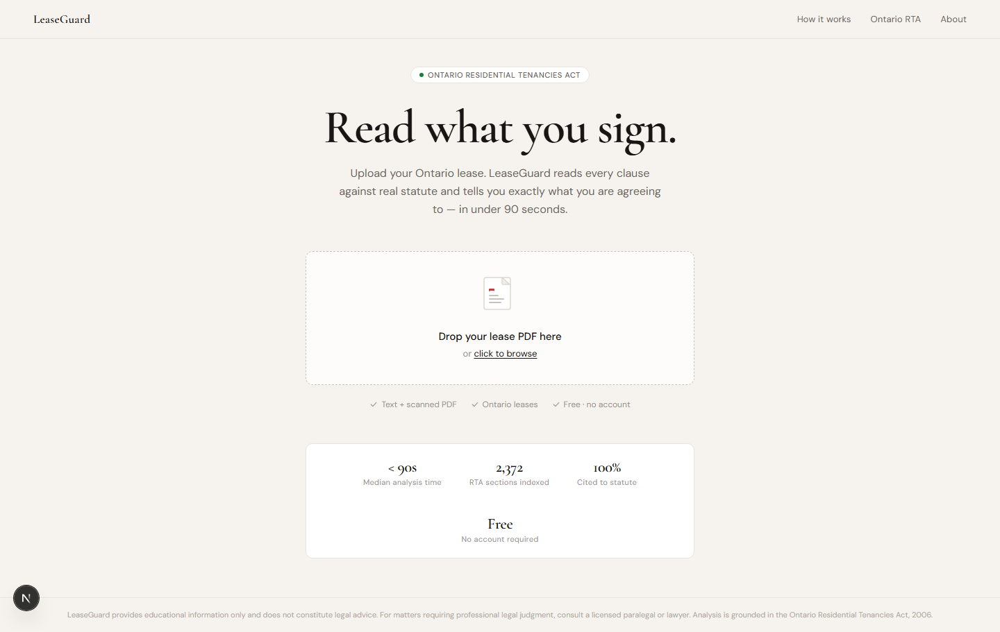
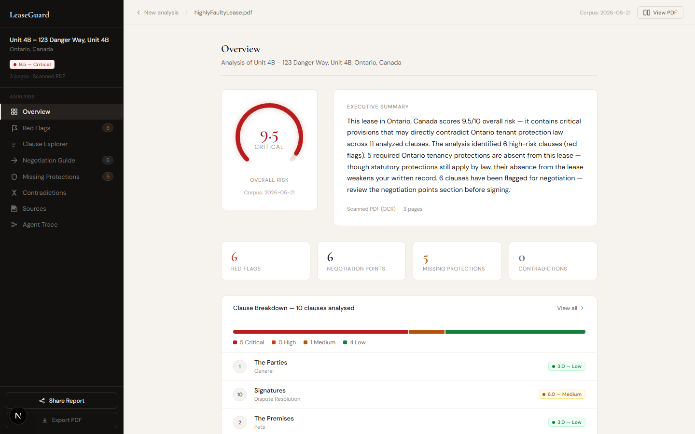
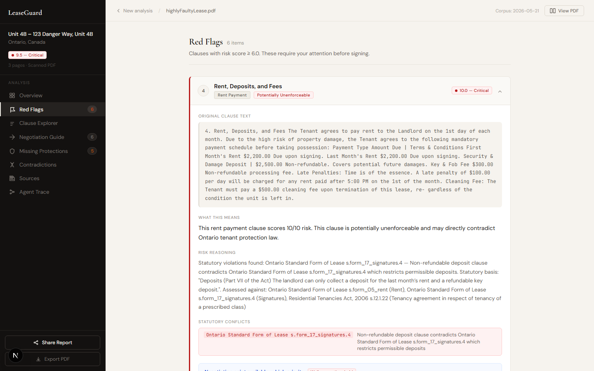
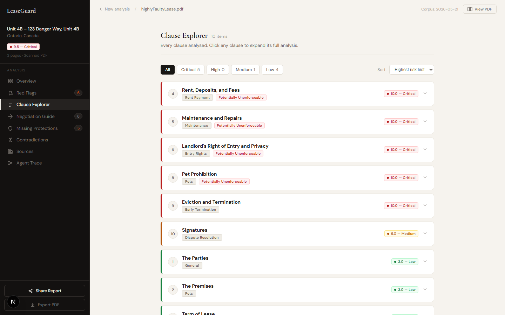
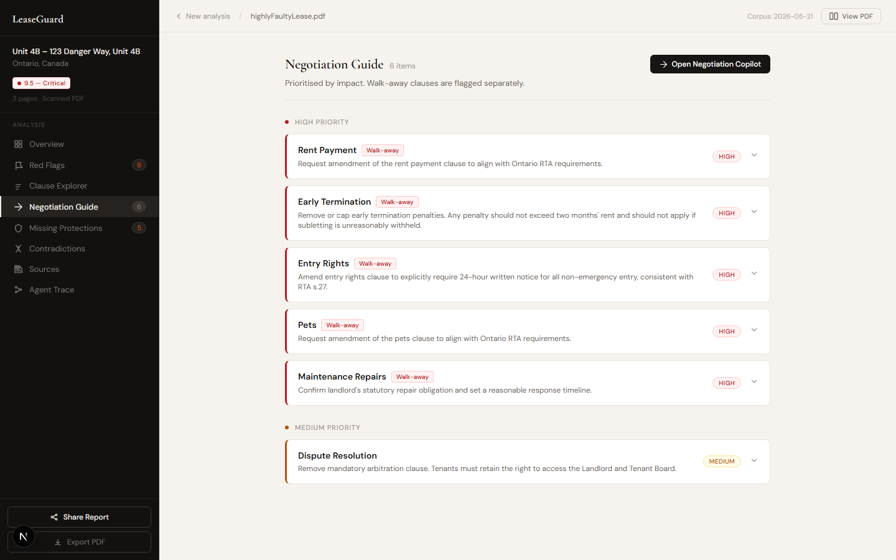
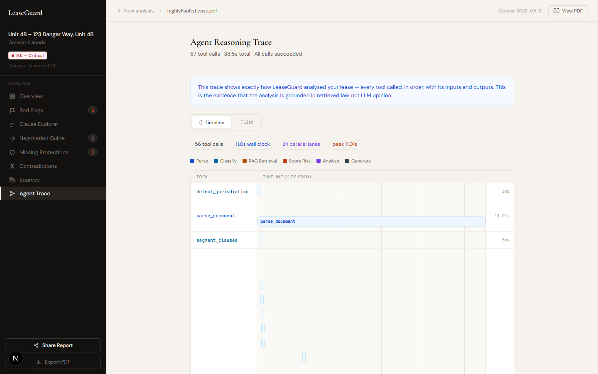

<div align="center">

# LeaseGuard

**AI-powered Ontario lease analysis grounded in real statute law.**

Upload your lease. Get a full risk report — every red flag cited to the RTA — in under 90 seconds.

[](https://github.com/parthiv-2006/lease-guard/actions/workflows/ci.yml)
[](#testing)
[](#testing)
[](https://www.typescriptlang.org/)
[](https://nextjs.org/)
[](#)



</div>

---

## What it does

LeaseGuard reads Ontario residential lease PDFs and produces a clause-by-clause risk report backed by retrieved statute and tribunal text. **The LLM never asserts legal facts from training data alone** — every finding is grounded in real law retrieved from a 2,372-chunk pgvector corpus of the Residential Tenancies Act, O.Reg 516/06, O.Reg 517/06, and the Ontario Standard Form of Lease.

The result: eight interactive panels covering risk scoring, red flags, missing protections, negotiation guidance, contradiction detection, statute sources, PDF annotation, and a live Gantt trace of the agent's reasoning.

---

## Report panels

<table>
<tr>
<td width="50%">

**Overview — 9.5 Critical**

Risk gauge, executive summary, and clause breakdown with per-clause risk levels.



</td>
<td width="50%">

**Red Flags**

Every problematic clause with its risk score, violation type, and the exact RTA section it breaches.



</td>
</tr>
<tr>
<td width="50%">

**Clause Explorer**

Full text of every clause, annotated with statute citations, enforceability status, and benchmark percentiles.



</td>
<td width="50%">

**Negotiation Guide + Copilot**

Prioritised negotiation points with counter-language. One-click AI copilot drafts a tone-aware letter (Assertive / Formal / Cooperative).



</td>
</tr>
<tr>
<td colspan="2">

**Agent Trace — Live Gantt**

Every tool call the agent made, with duration, parallel swim lanes, and input/output summaries. 67 tool calls for a 3-page lease.



</td>
</tr>
</table>

---

## How it works

```
User uploads PDF
       │
       ▼
Next.js API route ── creates job ──► Supabase Storage (PDF)
       │
       ▼
Claude Agent (MCP client)
       │  calls tools dynamically
       ▼
MCP Server — 12 tools
  ├─ parse_document        PyMuPDF + Tesseract OCR
  ├─ detect_jurisdiction   LLM + regex
  ├─ segment_into_clauses  LLM
  ├─ classify_clause       LLM
  ├─ lookup_statute   ─┐
  ├─ lookup_tribunal  ─┤── Supabase pgvector (Gemini embeddings)
  │                    │   Hybrid BM25 + vector, RRF merge, 3 queries/clause
  ├─ score_clause_risk ─── Deterministic TypeScript regex (NOT LLM)
  ├─ detect_contradiction  LLM (Haiku) with confidence gate ≥ 0.65
  ├─ check_missing_clauses Supabase checklist lookup
  ├─ benchmark_clause      Supabase PostgreSQL (50-row corpus)
  ├─ generate_negotiation  LLM (retrieved statutes as input)
  └─ generate_report       Structured assembly
       │
       ▼
Supabase PostgreSQL  +  pgvector  +  Storage
```

**Why grounded retrieval matters:** risk scoring is deterministic TypeScript — no LLM can hallucinate a score. Statute citations come from a pre-validated corpus (7/7 retrieval accuracy), not model memory. Clause enforceability is only flagged when a specific `MANDATORY_PROVISION_VIOLATION` is detected, not just because text sounds unusual.

---

## Tech stack

| Layer | Technology | Notes |
|-------|-----------|-------|
| Frontend | Next.js 15 (App Router, React 19) | TypeScript, vanilla CSS design system |
| Agent | Claude 3.5 Haiku via Anthropic SDK | MCP client — tool orchestration |
| Embeddings | Gemini `gemini-embedding-001` | REST only (768-dim); never the SDK |
| Vector DB | Supabase pgvector | Hybrid BM25 + vector, RRF merging |
| Database | Supabase PostgreSQL | Leases, clauses, reports, jobs, feedback |
| Storage | Supabase Storage | Uploaded PDFs, signed URL refresh |
| MCP Server | TypeScript / Node.js | 12 tools, stdio + SSE transport |
| PDF Parsing | Python (PyMuPDF + Tesseract) | Subprocess from MCP server |
| CI | GitHub Actions | Parallel typecheck + test + build |

---

## Getting started

### Prerequisites

- Node.js 20+
- Python 3.10+ with `pip`
- Tesseract OCR — `choco install tesseract` (Windows) or `brew install tesseract` (macOS)

### 1 — Clone and install

```bash
git clone https://github.com/parthiv-2006/lease-guard.git
cd lease-guard
npm install
cd mcp-server && npm install && cd ..
pip install -r scripts/requirements.txt
```

### 2 — Environment variables

Create `.env.local` in the project root (and `.env` — the MCP server reads this one):

```env
ANTHROPIC_API_KEY=sk-ant-api03-...        # From console.anthropic.com
GEMINI_API_KEY=AIzaSy...                  # From console.cloud.google.com
SUPABASE_URL=https://<project>.supabase.co
SUPABASE_ANON_KEY=eyJ...
SUPABASE_SERVICE_ROLE_KEY=eyJ...
NEXT_PUBLIC_SUPABASE_URL=https://<project>.supabase.co
NEXT_PUBLIC_SUPABASE_ANON_KEY=eyJ...
```

### 3 — Database migrations

```bash
# Apply all 6 migrations in supabase/migrations/ via the Supabase dashboard
# or with the Supabase CLI:
supabase db push
```

### 4 — Build the statute corpus

```bash
python scripts/build_corpus.py          # RTA granular subsections
python scripts/build_regulations.py     # O.Reg 516/06, O.Reg 517/06, Standard Form

# Validate retrieval accuracy (expect 7/7):
python scripts/validate_retrieval.py
```

### 5 — Run

```bash
# Terminal 1: Next.js dev server
npm run dev

# Terminal 2: MCP server (required for analysis)
npm run mcp:dev
```

Open [http://localhost:3000](http://localhost:3000) and upload a lease PDF.

---

## Testing

```bash
# Unit tests (100 passing)
npm test

# With coverage report
npm test -- --coverage

# Scoring accuracy eval — 15-case labelled suite (expect 15/15, 0 false positives)
node scripts/eval-accuracy.mjs

# Retrieval accuracy — validates pgvector corpus (expect 7/7)
python scripts/validate_retrieval.py

# MCP server type check + build
cd mcp-server && npm run build
```

**Test breakdown:**
- `__tests__/api-upload.test.ts` — upload route (file validation, size limits, MIME checks)
- `__tests__/api-report.test.ts` — report API (response shape, normalisation)
- `__tests__/api-job.test.ts` — job polling (SSE, status transitions)
- `__tests__/api-negotiation.test.ts` — negotiation copilot (tone variants, fallback)
- `__tests__/lib-agent.test.ts` — agent pipeline (tool call sequencing)
- `__tests__/trace-timeline.test.ts` — Gantt computation helpers (34 tests)
- `__tests__/rate-limiter.test.ts` — rate limiter (token bucket behaviour)

All external services (Supabase, Anthropic, Gemini) are mocked in `__tests__/setup.ts` — no credentials required to run the suite.

---

## CI

Every push and pull request to `main` runs three parallel jobs:

```
push / PR
    │
 ┌──┴──┐
type  test     ← parallel
 └──┬──┘
    │
  build        ← only if both pass
```

| Job | What it checks |
|-----|---------------|
| `typecheck` | `tsc --noEmit` on both the Next.js app and MCP server |
| `test` | Jest suite (100 tests), uploads lcov coverage artifact |
| `build` | MCP server `tsc` compile + Next.js production build |

See [`.github/workflows/ci.yml`](.github/workflows/ci.yml).

---

## Project structure

```
├── app/
│   ├── page.tsx                    Landing page + upload + job polling
│   ├── report/[id]/page.tsx        Report shell + normaliseApiResponse()
│   ├── components/
│   │   ├── overview-panel.tsx      Risk gauge, stats, clause breakdown
│   │   ├── panels.tsx              Red Flags, Clause Explorer, Negotiation,
│   │   │                           Missing Protections, Contradictions, Sources
│   │   ├── pdf-viewer.tsx          pdfjs-dist v5, canvas + text layer,
│   │   │                           persistent clause highlight annotations
│   │   ├── trace-timeline.tsx      Live Gantt chart (swim lanes, RRF)
│   │   └── shared.tsx              RiskArc, RiskBadge, StatCard, FeedbackBar
│   └── api/
│       ├── upload/route.ts         PDF intake, Supabase Storage, job creation
│       ├── job/[id]/route.ts       SSE job status stream
│       ├── report/[id]/route.ts    Fetches 4 tables in parallel
│       └── feedback/route.ts       Thumbs up/down with comment
│
├── lib/
│   ├── agent.ts                    14-step pipeline, parallel clause batches
│   ├── mcp-client.ts               stdio ↔ SSE transport auto-select
│   └── pdf-export.ts               jsPDF report + copilot export
│
├── mcp-server/src/
│   ├── tools/
│   │   ├── score-risk.ts           Deterministic regex scoring (NOT LLM)
│   │   ├── lookup-statute.ts       Hybrid BM25+vector, 3 queries, RRF
│   │   ├── detect-contradiction.ts LLM (Haiku), confidence gate 0.65
│   │   └── [9 other tools]
│   └── start.ts                    Entry point — dotenv then dynamic import
│
├── scripts/
│   ├── build_corpus.py             RTA granular subsection rows
│   ├── build_regulations.py        O.Reg 516/06 + 517/06 + Standard Form
│   ├── validate_retrieval.py       7/7 corpus accuracy check
│   ├── eval-accuracy.mjs           15-case precision/recall eval harness
│   └── capture-screenshots.mjs    README screenshot generation
│
└── supabase/migrations/            6 migrations (all applied)
    ├── 001_initial_schema.sql
    ├── 005_hybrid_search.sql       fts_vector column + GIN index + RPC
    └── 006_lease_address.sql       Property address extraction
```

---

## Legal disclaimer

LeaseGuard provides educational information only and does not constitute legal advice. For matters requiring professional legal judgment, consult a licensed paralegal or lawyer. Analysis is grounded in the Ontario Residential Tenancies Act, 2006.
